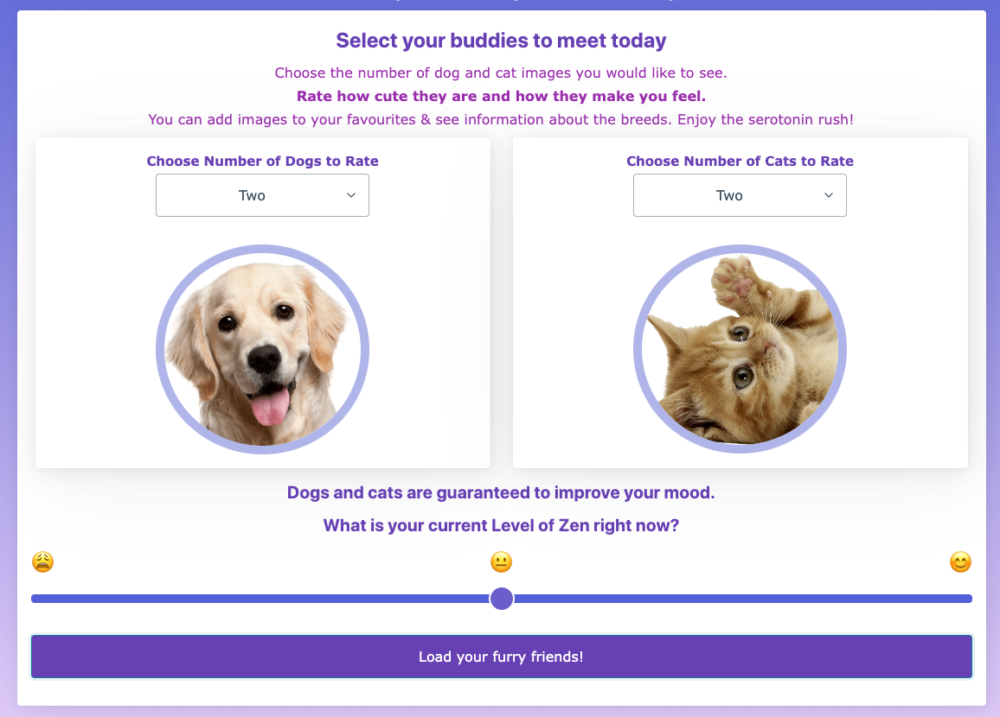
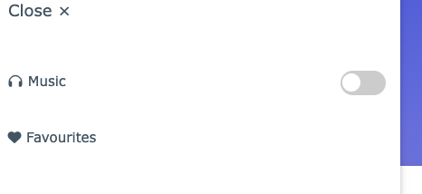
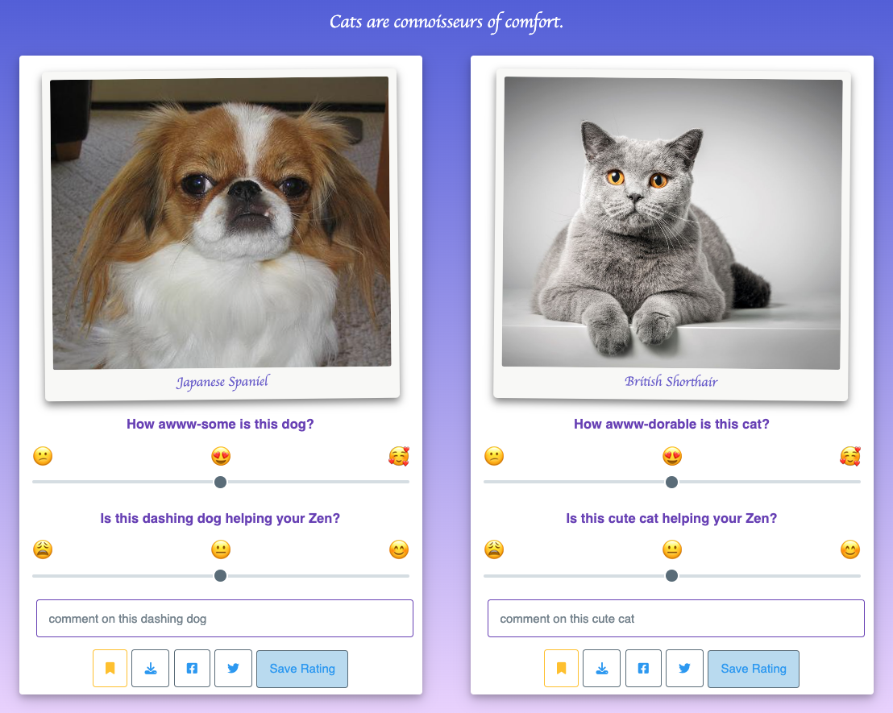
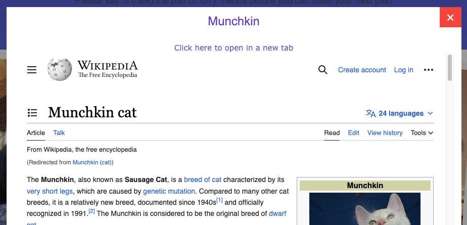
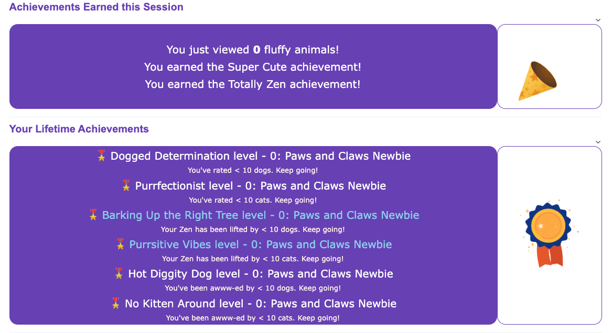
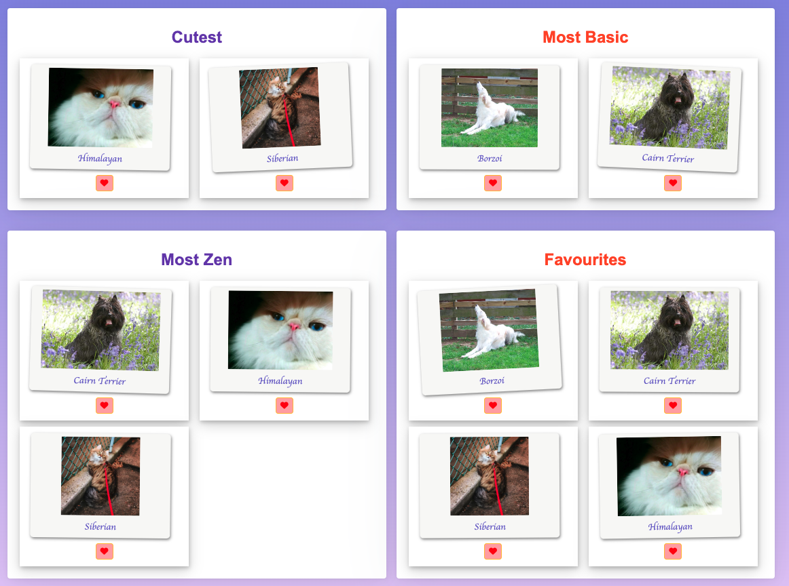
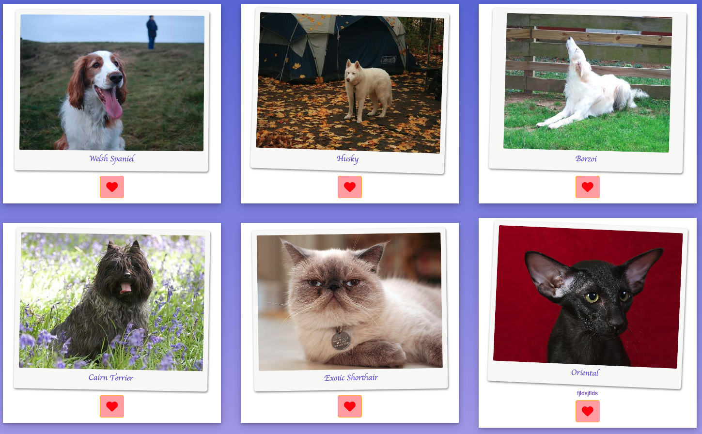

# Whiskers of Zen
Improve your mood with pictures of cute dogs and cats!

[Application Link](https://renemalingre.github.io/Whiskers-of-Zen/)

## Description

Whiskers of Zen is a unique digital oasis designed to whisk you away from your daily stress and immerse you in a world of cute, cuddly companions. 
Try this free web app today to improve your mood by viewing pictures of cute dogs and cats (yes, it actually [works](https://edition.cnn.com/2020/09/27/us/watching-cute-animals-study-scn-trnd/index.html) for stress)!

Features of this web app include:
- Generating random images of dogs and cats (user can select the number of images to generate for each).
- Keeping track of the user's stress level (via the 'Zen' level) - before and after using this app
- Rate each image for their 'Aww (cuteness) level', impact on the user's stress level - and earn achievement points along the way!
- Learn about different dog and cat breeds
- Favourite images - to look back later
- Relaxing background music (if desired)

On top of providing an avenue for users to view cute companion images and lower their stress, this app was also created in mind for its developers to put their web development knowledge and skills into practice, including (but not limited to) HTML, CSS frameworks, JavaScript, API integration, DOM manipulation... etc.

## Usage

- [Home screen](#home-screen)
- [App screen](#app-screen)
- [Ending screen](#ending-screen)
- [Favourites page](#favourites) 

### Home-screen ###

- Select the numbers of images of dogs and cats to generate (for each separately) via the dropdown.
- Move the slider based on your current mood (level of 'Zen'). This will be used to compare your stress level before & after the use of this app.
- Click on the button below to generate your pictures!

The sidebar can be accessed by the button on the top left of the page (appearance and functionality will vary across pages).

- Relaxing music feature - if you want to add some extra 'zen' to your experience
- Move to the favourites screen (where you can access your favourited pictures later)

### App-screen ###

After the loading screen, two images will appear at one time as cards with information on the breed of the dog/cat (and a bonus comfy quote).

- Rate each image for their cuteness & the impact on your stress level using the two sliders. The next pair of images will display once this is done.
- (optional) Favourite an image using the favourite (heart) button, and leave a comment for you to look back in the 'favourites' page later.
- Click on a photo to view the full resolution image (resolution will vary for each photo)
- Click on a breed name to learn more about that breed (will pop up as a modal). 

Once you finish rating all the images, you will be taken to the ending screen with your results!

The sidebar can be used to access:
- Relaxing music
- Home screen (can also be accessed using the browser's back button)
- Favourites page

### Ending-screen ###

The ending screen will display how much images you rated, how much 'Zen' (stress reduction) you've achieved and how cute you found the images.

Open the achievements tab to see what achievements you unlocked (based on how many & how you rated the images). Highlighted achievements indicate that you've earned that achievement!

Based on the ratings, images of various categories (e.g. the images that you rated the 'cutest') will be loaded. You can also favourite those images using the heart button if desired.

From here, you can:
- Go back to the home screen to generate more images
- Go to the favourites page to look back on images you've favourited

### Favourites ###

Images you've favourited will be saved on this page for your enjoyment.

You can unfavourite the image(s) also.

## Credits

Web app developed by:
- Ignazio Gaudio
- Lauren Cho
- Rene Malingre
- Sebastian Rodriguez

CSS frameworks used:

[pico.css](https://picocss.com/)

[W3 CSS](https://www.w3schools.com/w3css/defaulT.asp)

Elements used: 

[CSS Sidebar](https://www.w3schools.com/w3css/w3css_sidebar.asp) by W3 Schools

[Toggle Switch](https://www.w3schools.com/howto/howto_css_switch.asp) by W3 Schools

Third-party API:
[The Cat API](https://thecatapi.com/)

[Dog API (images)](https://dog.ceo/dog-api/)

[Dog API (dog information)](https://dogapi.dog/)

## License

Image assets under [Creative Commons (CC BY-NC 4.0)](https://creativecommons.org/licenses/by-nc/4.0/), non-commercial use.
 - [Cat PNG 2](https://freepngimg.com/png/19879-cat-png-2) by Alexis Bailey
 - [Dog File](https://freepngimg.com/png/23730-dog-file) by Brett Croft 

MIT Licensed unless otherwise indicated.

<!-- ## Features -->

